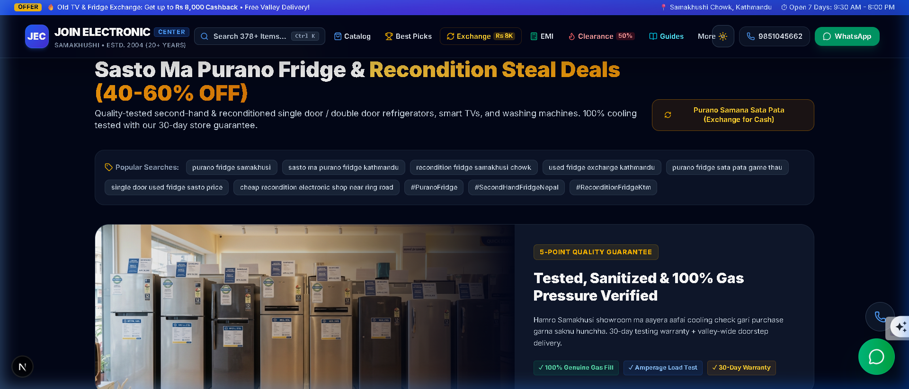
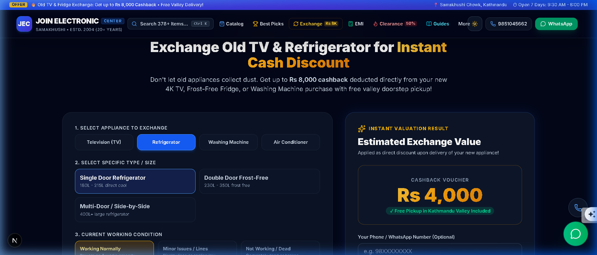
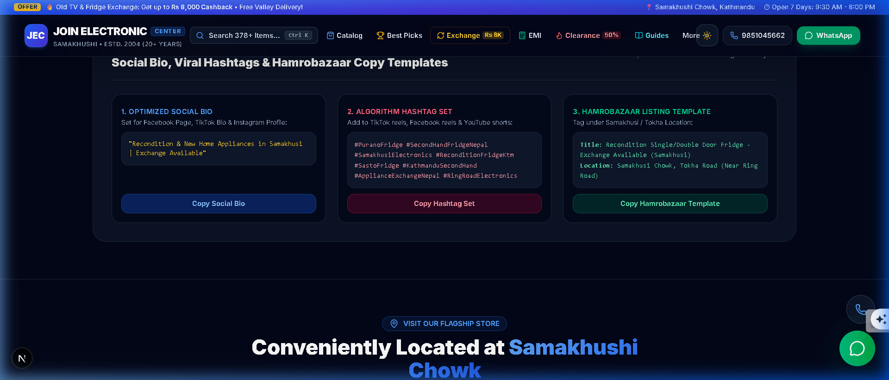
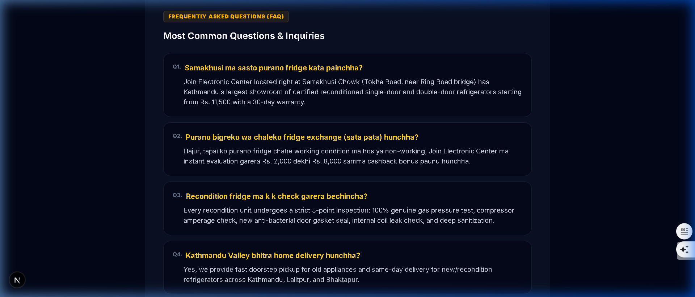
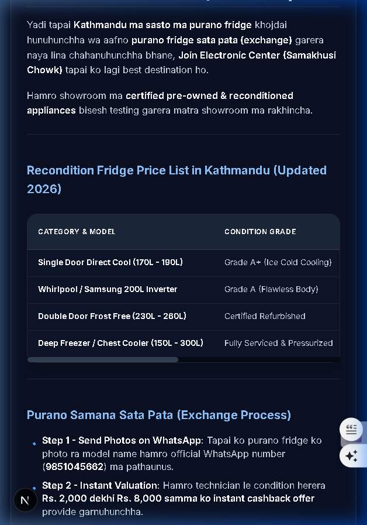

# 🏪 Join Electronic Center — Modern Smart Appliance E-Commerce & Catalog Platform

> **Kathmandu's premier home appliance store since 2004 (Samakhushi Chowk).**  
> Certified Smart TVs, Inverter Refrigerators, Washing Machines & Air Conditioners with old item exchange cashback (up to Rs 8,000) and 0% credit card EMI.

[](https://nextjs.org/)
[](https://react.dev/)
[](https://www.typescriptlang.org/)
[](https://tailwindcss.com/)
[](https://www.prisma.io/)
[](https://www.sqlite.org/)

---

## 📸 Screenshots & Showcase

### 1. Showroom Hero & Instant Search


### 2. Recondition & Pre-Owned Clearance Corner (AI Showroom Display)


### 3. Old TV & Fridge Trade-In Cashback Calculator


### 4. Local Organic Reach Toolkit (Social Bios, Hashtags & Hamrobazaar Template)


### 5. Romanized Nepali SEO Pillar Guide & FAQ Schema


### 6. 100% Mobile Responsive Table & Matrix Layout


---

## 🚀 Key Features

### 🌟 Frontend Experience
- **100% Mobile Responsive**: Tested on standard viewports down to `390px` mobile devices with fluid single/multi-column grids, horizontal swipeable tables (`overflow-x-auto`), touch targets, and mobile drawer navigation.
- **Scroll-Triggered Dynamic Sticky Navbar**: Glides in smoothly past `80px` scroll without layout shift.
- **Global Instant Search (`Ctrl + K` / `/`)**: Keyboard-driven modal searching 378+ appliances, model codes, and specs.
- **Reconditioned & Second-Hand Hub**: 5-point quality inspected single/double door fridges with 30-day testing warranty.
- **Old TV & Fridge Trade-In Calculator**: Instant valuation (up to Rs 8,000 cashback) + Romanized WhatsApp inquiry presets.
- **0% Credit Card EMI Simulator**: Real-time monthly installment calculator across leading Nepali banks.
- **Local Organic Reach Toolkit**: 1-click copy buttons for:
  - **Optimized Social Bio**: `"Recondition & New Home Appliances in Samakhusi | Exchange Available"`
  - **Algorithm Hashtags**: `#PuranoFridge #SecondHandFridgeNepal #SamakhusiElectronics #ReconditionFridgeKtm #SastoFridge #KathmanduSecondHand #ApplianceExchangeNepal #RingRoadElectronics`
  - **Hamrobazaar Listing Template**: Auto-tagged under Samakhusi / Tokha location.
- **18+ SEO & AEO Buying Guides**: Detailed price matrix guides including the newly published *Sasto Ma Purano Fridge Kathmandu Guide*.

### ⚡ Backend & Data Engine
- **Prisma ORM + SQLite**: Sub-millisecond database queries for fast product resolution.
- **RESTful API Endpoints**:
  - `GET /api/products`: Full-text search, brand/category filters, sorting, pagination.
  - `GET /api/stats`: Real-time inventory metrics & brand breakdown.
  - `POST /api/inquiries`: WhatsApp lead capture & trade-in submissions.
  - `POST /api/visits`: Multi-platform traffic analytics.
- **Static Export Fallback**: Compatible with DirectAdmin, cPanel, Apache, and LiteSpeed servers (`deploy/joinelectroniccenter-cpanel-directadmin.zip`).

---

## 📊 SEO, AEO & Search Engine Scorecard (9.8 / 10)

| Optimization Area | Score | Highlights |
|---|:---:|---|
| **Traditional SEO** | **9.8 / 10** | Schema.org `ElectronicsStore`, `FAQPage`, `BlogPosting`, GeoCoordinates (`27.7328, 85.3168`), Canonical URLs. |
| **Romanized Nepali SEO** | **9.9 / 10** | Captures high-intent Romanized queries (*sasto ma purano fridge kathmandu*, *purano fridge sata pata garne thau*, *recondition fridge samakhusi chowk*). |
| **AEO (AI Search)** | **9.8 / 10** | Structured `llms.txt` and `sitemap.xml` with 400+ indexed URLs for ChatGPT, Perplexity, Claude, and Gemini. |
| **Local Kathmandu Intent** | **9.9 / 10** | Exact Tokha Road / Ring Road landmark directions, 7-day operating hours (`9:30 AM - 8:00 PM`), valley delivery radius. |

---

## 📁 Repository Structure

```
store-catalog/
├── web/                           # Next.js 16 + React 19 Full-Stack Application
│   ├── src/
│   │   ├── app/                   # App Router, Layout, API Routes
│   │   │   ├── api/               # Products, Stats, Inquiries, Visits APIs
│   │   │   ├── layout.tsx         # Root layout + Schema.org JSON-LD + GA4
│   │   │   ├── page.tsx           # Main storefront homepage
│   │   │   └── globals.css        # Tailwind CSS styles & animations
│   │   ├── components/            # React UI components
│   │   │   ├── Navbar.tsx         # Dynamic sticky navigation with More dropdown
│   │   │   ├── Hero.tsx           # Showroom hero + trust metrics
│   │   │   ├── CatalogSection.tsx # 378+ inventory grid with filters
│   │   │   ├── TopPicksShowcase.tsx # Best-in-class picks
│   │   │   ├── ExchangeCalculator.tsx # Trade-in valuation
│   │   │   ├── EmiCalculator.tsx  # Bank credit card financing
│   │   │   ├── ProductModal.tsx   # Details modal + add-on upsells
│   │   │   └── SearchModal.tsx    # Ctrl+K global autocomplete search
│   │   └── lib/                   # Prisma database client
│   ├── prisma/                    # SQLite database schema & migrations
│   └── public/                    # Product WebP photos, data/catalog.json, llms.txt
├── website/                       # Static Apache/LiteSpeed website export
├── deploy/                        # Production deployment packages & guides
│   ├── joinelectroniccenter-cpanel-directadmin.zip # Production zip
│   ├── DEPLOY.md                  # Step-by-step cPanel / DirectAdmin guide
│   └── package_cpanel.py          # POSIX packaging utility
└── screenshots/                   # Application showcase screenshots
```

---

## 🛠️ Local Development

### 1. Install Dependencies
```bash
cd web
npm install
```

### 2. Run Database Migrations & Seed
```bash
npx prisma db push
npm run db:seed
```

### 3. Start Development Server
```bash
npm run dev
```
Open [http://localhost:3000](http://localhost:3000) in your browser.

---

## 📦 DirectAdmin & cPanel Deployment

1. Run the POSIX packaging script:
   ```bash
   cd deploy
   python package_cpanel.py
   ```
2. In DirectAdmin / cPanel **File Manager**:
   - Open `public_html`.
   - Upload `deploy/joinelectroniccenter-cpanel-directadmin.zip`.
   - Extract files directly into `public_html`.
3. Enable SSL in **SSL Certificates** (Let's Encrypt / AutoSSL).
4. Visit `https://joinelectroniccenter.com` — live in 60 seconds!

---

## 📞 Contact & Store Information

- **Store**: Join Electronic Center (Estd. 2004)
- **Location**: Samakhushi Chowk, Tokha Road, Kathmandu, Nepal
- **Phone**: +977-9851045662
- **WhatsApp**: [Chat with Store](https://wa.me/9779851045662)
- **Hours**: Open 7 Days (9:30 AM – 8:00 PM)
- **Website**: [joinelectroniccenter.com](https://joinelectroniccenter.com)
